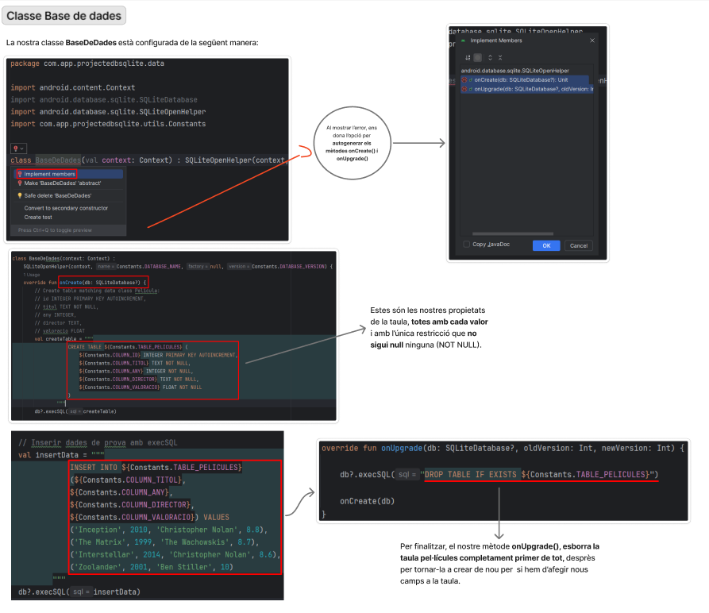
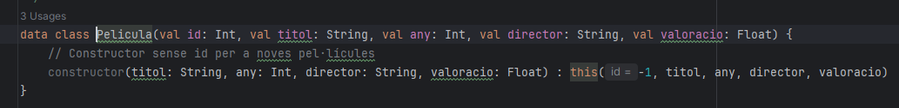
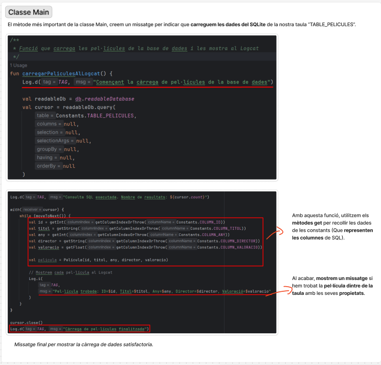
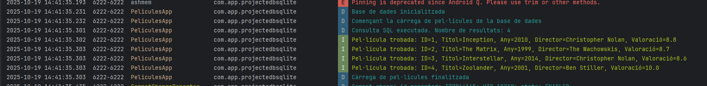

<h1>Treballant amb SQLite a Android</h1>

# Introducció

Aquesta activitat té com a objectiu crear una aplicació Android simple que emmagatzemi i recuperi informació d’una base de dades SQLite interna. També s'ha creat la base de dades, definides les taules, inserir registres i llegir les dades de la taula. El resultats es mostraràn a la consola (Logcat).

## Passos que s'han seguit:

1. Configuració del projecte: Crear un nou projecte Android (Empty Activity) amb Kotlin.
2. Definir la base de dades amb SQLiteOpenHelper i sobreescriviu onCreate i onUpgrade.
3. Inserir dades de prova amb ContentValues o execSQL.
4. Recuperar les dades mitjançant una consulta SELECT i mostreu-les al Logcat.
5. Verificar que les dades inserides i recuperades coincideixen.

## Explicació del desenvolupament

### 1. Creació de la base de dades:
   - S'ha creat una classe que hereta de SQLiteOpenHelper per gestionar la creació i actualització de la base de dades.
   - S'ha definit l'esquema de la base de dades amb una taula.
   - S'ha implementat el mètode onCreate per crear la taula quan es crea la base de dades per primera vegada.
   - S'ha implementat el mètode onUpgrade per gestionar les actualitzacions de l'esquema de la base de dades.
   - S'ha utilitzat el mètode execSQL per inserir registres a la taula.
   - S'han inserit diversos registres de prova per verificar el funcionament de la base de dades.

## Captures de pantalla Documentat:

   

### 2. Classe main activity:

- A la classe MainActivity es crea una instància de la classe que gestiona la base de dades.
- S'utilitza el mètode readableDatabase per obtenir una instància de la base de dades en mode lectura.
- S'executa una consulta SELECT per recuperar totes les files de la taula.
- S'utilitza un Cursor per iterar sobre els resultats de la consulta.
- S'imprimeixen els valors recuperats al Logcat per verificar que les dades s'han recuperat correctament.

## Captures de pantalla Documentat:

## Resultats finals obtinguts al logcat:

Aqui es poden veure els resultats obtinguts al logcat, on es notifica cada acció realitzada a la base de dades, com la creació de la taula, la inserció de registres i la recuperació de dades.

Al final es pot veure que ens notifica de que la càrrega de dades ha estat correcta.

## Link d'acces a la documentació realitzada amb figma:

https://www.figma.com/board/KQh0UxW1JdI1Cbpp4hu8Sk/Documentaci%C3%B3-SQLite?node-id=0-1&t=VUHl2dt8qwc7PUqP-1
